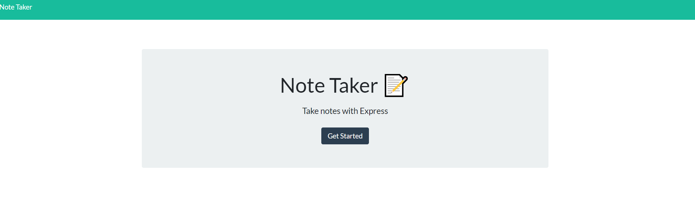
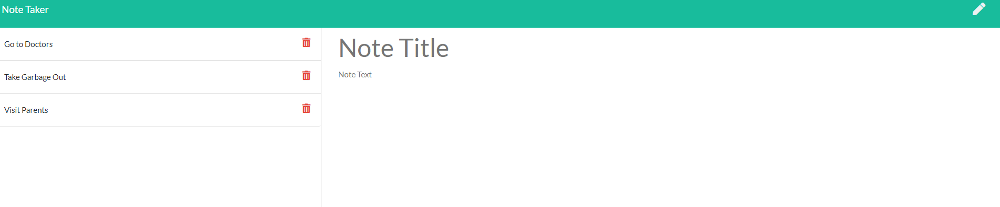

# Note Taker
Application that allows user to take, save, and delete notes

## Table of Contents
* Overview
* Technologies
* Status
* Screenshot

## Overview
This is an assignment using Node, JS, NPM, and Express. The goal of the assignment is to create an app that allows the user to take and save notes. The user is able to write in the "note title" and the "note text". There is also added functionality that allows user to delete.

## Technologies
Project created with:
* Node
* JS
* NPM
* Express

## Status
To view my project please visit the below.

[Team Profile Generator Guide](https://dashboard.heroku.com/apps/notetaker-19926)

## Screenshot

)
)